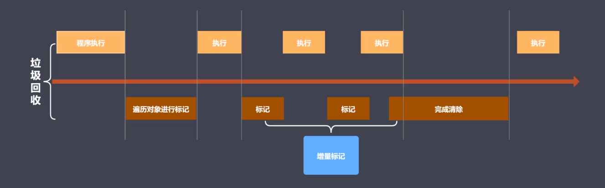

# 内存管理
js 无内存的相关api

申请 使用 释放
# 垃圾回收与常见GC算法
1.js自动回收  
2.对象不在被访问是垃圾  能访问，能引用
3、对象不能从根上访问到时  

>全局执行上下文为根

## js中的引用 可达 
## GC中的垃圾
>程序中不在需要使用的对象  
程序中不能再访问的对象
## 常见GC算法
### 引用计数  
核心思想：设置引用数，判断当前引用数是否为0
>引用计数器 引用关系改变时修改引用数字 

优点：发现垃圾立即回收；最大限度减少程序暂停  
缺点：无法回收循环引用对象；时间/资源开销大

### 标记清除  
核心思想：分标记和清除2个阶段完成
> 遍历所有的对象找标记活动对象  
遍历所有对象清除没有标记活动对象  
回收相应空间，放到一空闲列表中

优点：能解决循环引用问题   
缺点：地址不连续，造成空间碎片化

### 标记整理  
是标记清除 的增强；清除阶段会执行整理，移动对象位置

优点：减少碎片化空间  
缺点：不会立即回收垃圾对象
### 分代回收
# v8引擎的垃圾回收
v8是主流的js执行引擎；采用即时编译；v8内存设限  64不超1.5G 32 不超800M
## 回收策略
采用分代回收思想；内存分为新生代、老生代；针对不同对象采用不同算法  
v8中常用的GC算法
>分代回收  
空间复制  
标记清除  
标记整理  
标记增量  

v8内存一分为2，小空间用于存储新生代对象，一般大小（32M|16M），新生代是指存活时间比较短的对象  
大空间存储老生代对象，大小（1.4G | 700M）,老生代市值存活时间比较长的对象（全局变量，闭包等）；
## 新生代对象回收实现
1、回收过程采用复制算法+标记整理  
2、新生代内存区分为2个等大小空间  
3、使用空间为from，空闲空间为to  
4、活动对象存储于from空间  
5、标记整理后将活动对象拷贝至to   
6、from与to交换空间完成释放 

>拷贝过程中可能出现晋升  
晋升是指将新生代对象移动到老生代  
一轮GC还存活的新生代需要晋升  
To空间使用率超过25%需要晋升
## 老生代对象回收实现
1、主要采用标记清除（快速回收垃圾，性能提升，会产生碎片化）、标记整理（新生代晋升时，碎片化整理）、增量标记算法  
2、首先使用标记清除完成垃圾空间的回收  
3、采用标记整理进行空间优化  
4、采用增量标记进行效率优化

> 新生代区域垃圾回收 使用空间换时间  
老生代区域不适合复制算法

# Performance工具及内存问题
内存问题的外在表现  
1、页面出现延迟加载或经常性暂停  
2、页面持续出现糟糕的性能  
3、页面的性能随时间延长性能越差

# 代码优化实例
https://jsperf.com/  

#### 慎用全局变量
1、在作用域链的最顶端  
2、不会回收  
3、不小心会污染全局变量。
#### 缓存全局变量
如果全局变量无法避免,采用缓存。。比如 document
#### 通过原型新增方法 
prototype
#### 避开闭包陷阱
通过手动释放
#### 避免属性访问方法使用
#### for循环优化

有些计算的属性，提前定义，比如循环长度
#### 采用最优循环方式
forEach > for(优化后) >forin 
#### 文档碎片优化节点添加
> document.createDocumentFragment()
#### 克隆优化节点操作
针对一样节点的操作

#### 直接替换new Object

直接字面量（var a = []）比 new关键字（var a = new Array()）性能快。
