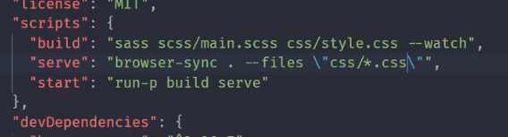

# 开发脚手架及封装自动化构建工作流

## 工程化
工程化遵循规范， 依靠工具提升效率，降低成本的手段
### 解决问题
1、传统语言的或语法的弊端  
2、无法使用用模块化/组件化  
3、重复的机械工作  
4、代码风格统一、质量保证  
5、依赖后端服务接口支持  
6、整体依赖后端项目 

## 脚手架工具开发
脚手架 解决创建项目中的重复工作。   

### 简易脚手架流程
一、通过npm或者yarn 创建package.json文件  
二、在package.json中创建一个bin字段
```
{
  "name": "sample-scaffolding",
  "version": "1.0.0",
  "description": "",
  "main": "index.js",
  "bin":"cli.js",//项目入口文件
  "scripts": {
    "test": "echo \"Error: no test specified\" && exit 1"
  },
  "keywords": [],
  "author": "",
  "license": "ISC"
}

```
三、创建cli.js  
有以下注意事项
>1、Node CLI应用入口文件必须要有 #!/usr/bin/env node 的文件头  
2、如果是LINUX或者macos系统，还需要修改此文件的权限为755  
具体就是通过 chmod 755 cli.js实现修改

四、通过yarn link 命令 或者 npm link 命令，把项目link到全局，就可以通过package.json的name直接运行。

五、cli.js 脚手架工作过程
1、通过命令交互询问用户问题 ；根据用户回答的结果生成文件
> 通过 inquirer 模块实现   
ejs模板引擎
同目录下创建templates 创建模板文件

```
#!/usr/bin/env node

const fs = require('fs')
const path = require('path')
const inquirer = require('inquirer')
const ejs = require('ejs')

inquirer.prompt([
    {
        type:'input',//类型
        name: 'name',//字段
        message: 'project name is:'//问题描述
    },
    {
        type: "checkbox",
        message: "选择颜色:",
        name: "color",
        choices: [
            {
                name: "red"
            },
            {
                name: "blur",
                checked: true // 默认选中
            },
            {
                name: "green"
            },
            {
                name: "yellow"
            }
        ]
    }
])
.then(answer =>{
    //模板目录
    const temlDir = path.join(__dirname, 'templates')
    //目标目录
    const destDir = process.cwd()
    //讲模板下的文件全部转换到目标目录
    fs.readdir(temlDir , (err, files)=>{
        if(err) throw err;
        files.forEach(file=>{
            //通过模板引擎渲染文件
            ejs.renderFile(path.join(temlDir, file), answer, (err, result)=>{
                if(err) throw err;
                //将结果写入目标文件
                fs.writeFileSync(path.join(destDir, file), result)
            })
        })
    })

})


```

## 自动化构建系统
一切重复工作本应自动化
### npm Srcipts 实现自动化构建工作的最简方式
> pack.json中，scripts字段中 加入执行命令

依赖模块  brower-sync ,启动web服务器  
依赖模块  npm-run-all, 同时启动多个命令



### 常用的构建工具
Grunt Gulp Fis   
webpack 为模块打包工具

#### Grunt
gruntfile.js  为入口文件，基本结构如下
```
// grunt的入口文件
// 用于定义一些需要 Grunt自动执行的任务
// 需导出一个函数
// 次函数接受一个 grunt的形参，内部提供一些创建任务时可以用的api


module.exports = grunt=>{
    grunt.registerTask('foo',()=>{  //注册任务  
        //代码
    })
}


yarn grunt foo / npm run grunt foo(foo为注册的名称)
```
>名称 'default'为默认任务  
异步任务，需执行 this.async() 方法
同步任务 return false  异步任务this.async()(false) 可标记任务失败   
--force 可继续执行下一个任务

插件使用  
grunt.loadNpmTasks('名称')

#### Gulp
#### Gulp基本了解
gulpfile.js  为入口文件，基本结构如下
```
//对外导出一个函数 foo 为任务名称
exports.foo = (done)=>{
    ...
    done() //执行回调，确定任务结束。

}
```
>名称 'default'为默认任务  
可用gulp-load-plugins 插件加载用到的插件 
```
const loadplugins = require('gulp-load-plugins')
const plugins = loadplugins()
plugins.xxx // gulp-去掉，后面转驼峰形式。
```
#### Gulp组合任务
利用 'gulp'下的series,parallel 方法
```
const {下的series , parallel}  = require('gulp')

const task1 = done=>{
    setTimeout(()=>{
        ....
    },1000)
}

const task2 = done=>{
    setTimeout(()=>{
        ....
    },1000)
}
//创建串行任务
exports.foo = series(task1,task2)

//创建并行任务
exports.bar = parallel(task1,task2)
```
#### gulp的处理异步流程的操作
> 错误优先

1、通过回调函数完成 ，失败则传入Errow对象  
2、返回 Promise   
3、async / await  
4、返回Stream对象  
#### gulp构建流程
读取流=》转换流=》输出流
#### gulp的文件操作
src 创建读取流 
> 第一个参数是路径， 第二个参数是对象  { base:'基准路径'}  

dest 创建转换流
转换流可以根据需要现在不同插件，比如gulp-clean-css（压缩css） gulp-rename(重命名)
```
const {src ,dest} = require('gulp')

exports.default = ()=>{
    retrun src('src/*.css')
            .pipe(dest('dist'))
}
```
#### gulp开发服务器
利用browser-sync 模块,简单示例
```
const {watch} = require('gulp') //利用watch方法，监控文件变化

const browserSync = require('browser-sync')
const bs = browserSync.create()

const serve = ()=>{
    watch('文件路径','任务名')
    bs.init({
        notify:false,//关闭默认展示
        port:3000,//端口号 ，默认3000
        open:false,//是否自动打开网页，默认true
        files:'dist/**',//监控文件变化，自动刷新  
        server:{
            baseDir: 'dist'  //支持数组，多个路径
        }
    })
}
```
